# portfolio_app

This is my portfolio app which includes -  
Home Screen: Brief introduction, profile picture, and bio. 
About Me Section: Skills, experience, and interests. 
Projects Section: Showcase 3-5 projects with details (name, description, technologies used). 
Contact Section: Email, phone number, and social media links. 
Navigation: Use a bottom navigation bar or drawer menu. 
Responsive Design: Ensure the app looks good on both mobile and tablet devices. 

#### App link

https://drive.google.com/file/d/1qzRgg2D2GkXWbmV-rLxdk1J4q-qpC8F4/view?usp=drive_link

## UI Design

#### Home Screen

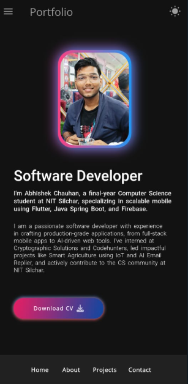 
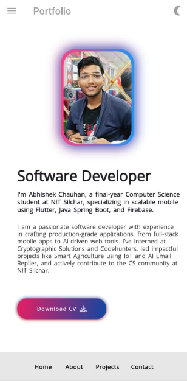

#### About Me Screen

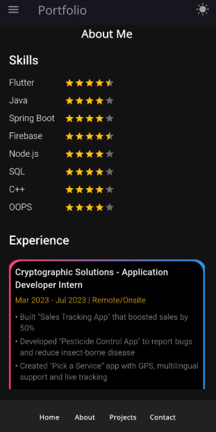
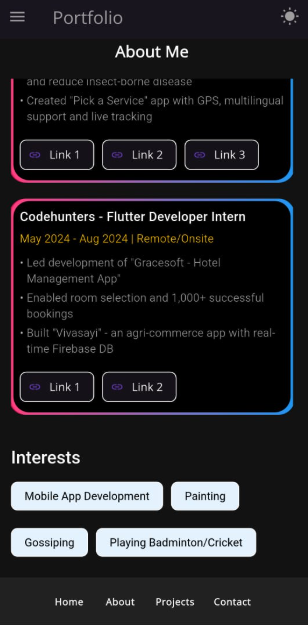
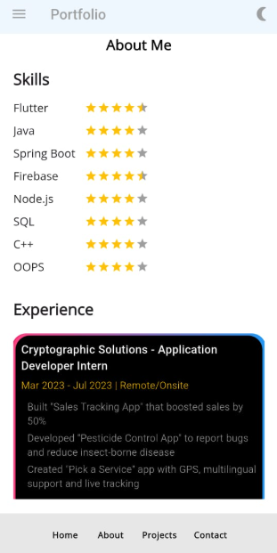
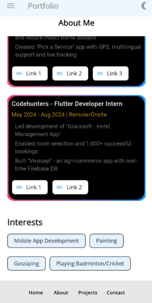

#### Projects Screen

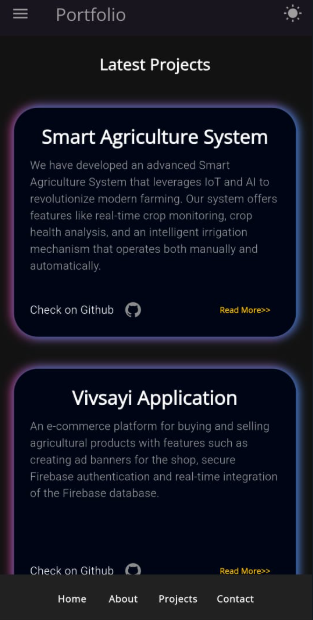
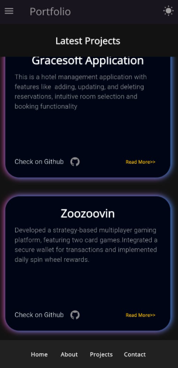
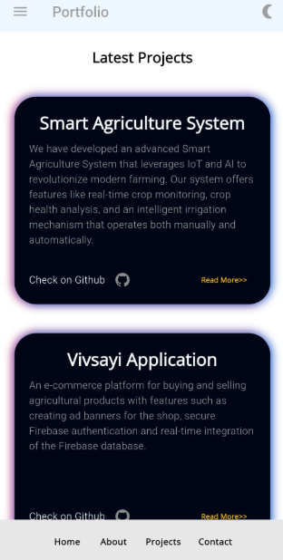
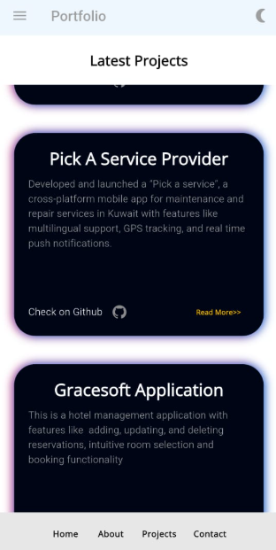

#### Contact Screen

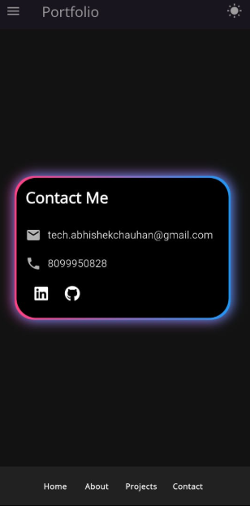
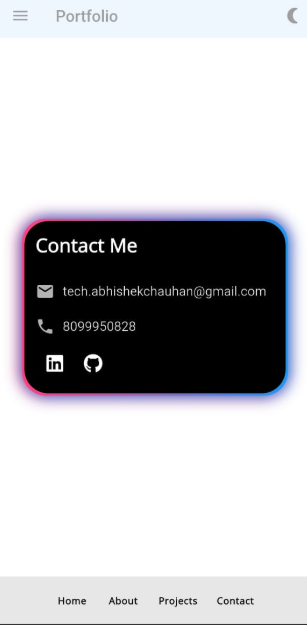

#### Drawer

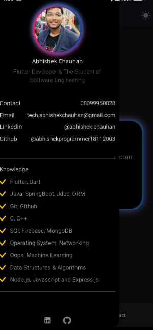
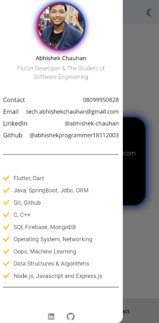

